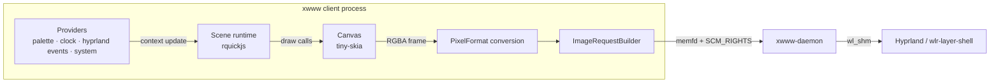

# Scene engine (smart wallpapers)

**Status:** F1 implemented behind the `scene` feature (off by default). F2/F3 are still proposals.
**Target compositor:** Hyprland (any `wlr-layer-shell` compositor in principle).
**Deliverable of this document:** scope, architecture, contracts and ADRs for `xwww scene`.

## Goal

Let users author procedural, reactive wallpapers in JavaScript. A scene defines shapes, colors and
animations; it can react to an external color palette (primary use case: the `equisdots` palette
on Hyprland) and to compositor events (workspace, active window, monitors) without ever receiving
pointer input. Frames are rendered by the client and displayed by the existing daemon through the current
image pipeline.

## Non-goals

- Pointer/keyboard interactivity. Scenes react to external triggers only; the wallpaper stays
  click-through.
- Running JavaScript inside `xwww-daemon`. The daemon remains a "dumb" frame consumer.
- Compositors without `wlr-layer-shell` (GNOME is still unsupported, as with the rest of `xwww`).
- Network or filesystem access from scene code.
- High-framerate (60 fps) full-screen procedural animation in F1/F2. See F3.

## Architecture



Everything new lives in the **client** crate. The daemon and the IPC protocol are untouched
through F2. This is possible because the client already owns all pixel work: decoding, resizing,
effects and compression (`client/src/imgproc.rs`, `client/src/effects.rs`), and because
`process_xwww_args` (`client/src/main.rs:136`) can be reused from any subcommand, exactly as
`slideshow.rs:40` does today.

The engine reuses two assets that are already in the build:

- **tiny-skia** is already compiled as a transitive dependency of `resvg` and is used in
  `client/src/palette.rs:82`. No new graphics dependency is needed for the canvas.
- **jzon** is already used for JSON (`client/src/palette.rs:148`). Palette files (pywal/wallust)
  can be parsed without adding `serde_json`.

## Command surface

```sh
xwww scene check  scene.js                                    # compile only
xwww scene render scene.js -o out.png --size 2560x1440        # one-shot render (debugging)
xwww scene run    scene.js --fps 10 --palette equisdots       # run until interrupted
```

| Flag | Default | Commands | Meaning |
|------|---------|----------|---------|
| `--fps` | `10` | `run` | Frames per second rendered and pushed to the daemon. |
| `--size` | `2560x1440` | `render` | Canvas size in `WxH` physical pixels. |
| `--palette` | `~/.config/xwww/palette.json`, then equisdots, then fallback | all | Palette source: `xwww[:<path>]`, `equisdots[:<slug>]`, `file:<path>`, `command:<cmd>`. |
| `--timeout-ms` | `100` | all | Per-frame JavaScript execution budget before the call is aborted. |
| `--asset <PATH>` | scene's directory | `render`, `run` | Extra directory (or file) whose images the scene may load with `canvas.image`. Repeatable. |
| `-o, --outputs` | all | `run` | Comma-separated list of outputs. |
| `-n, --namespace` | `""` | `run` | Daemon namespace. |
| `--transition-type` | `none` | `run` | Entry transition for the first frame: the same set as `xwww img` (`simple`, `fade`, `wipe`, `grow`, `outer`, `wave`, `glitch`, `decrypt`, `dissolve`, `clock`, `zoom`, `left/right/top/bottom/center`, `random`). |
| `--transition-duration` | `1.0` | `run` | Seconds the entry transition takes; the loop waits for it before sending instant frames. |
| `--transition-fps` | `144` | `run` | Frame rate of the entry transition. |
| `--transition-step` | `255` | `run` | Step for `simple` (255 = instant). |
| `--transition-pos` / `--transition-angle` / `--transition-bezier` / `--transition-wave` | as `img` | `run` | Shape parameters of the entry transition. |
| `--palette-fade` | `600` | `run` | Crossfade in milliseconds when the active palette changes (`0` disables it). The previous frame is blended over the new one while it fades out. |

`xwww scene` is declared as a non-standard command and dispatched before the IPC flow, like
`Palette`/`Slideshow`/`Screenshot` in the client. Builds without the `scene` feature still show the
subcommand in `--help`, but it fails with a clear message.

## Scene runtime contract (JavaScript)

A scene is a single ES module (`scene.js`) with two optional top-level functions:

```js
function setup(ctx) {
  // runs once, when the scene loads and whenever the context definition changes
}

function render(t, ctx) {
  // runs once per frame; t = seconds since scene start
  // must finish within the frame budget; errors keep the last good frame
}
```

### `ctx` (read-only, rebuilt per frame)

```js
{
  width, height,       // output size in physical pixels
  frame,               // monotonically increasing frame counter
  now,                 // wall clock, ms since epoch
  palette: {
    slug: "x",                 // active palette, e.g. settings.json -> bar.palette
    name: "X",
    background: { hex: "#050505", r: 5, g: 5, b: 5 },
    foreground: { hex: "#f7f1ff", r: 247, g: 241, b: 255 },
    colors: [ /* base16 color0..color15 as { hex, r, g, b } */ ],
    roles: { workspaceActive: { hex: "#eab308", r: 234, g: 179, b: 8 } },
  },
  events: [],          // F2; empty array for now
}
```

### Global `canvas`

Backed by tiny-skia. Colors accept `#rgb`, `#rrggbb`, `#rrggbbaa` or `[r,g,b(,a)]`.

| Call | Notes |
|------|-------|
| `canvas.clear(color)` | Overwrites the whole surface (no blending). |
| `canvas.fill(color)` / `canvas.no_fill()` | Sets the fill paint used by the next shapes/paths. |
| `canvas.stroke(color, width)` / `canvas.no_stroke()` | Sets the stroke paint. |
| `canvas.alpha(a)` | Opacity multiplier for subsequent paints. |
| `canvas.rect(x, y, w, h)` | |
| `canvas.circle(cx, cy, r)` | |
| `canvas.round_rect(x, y, w, h, r)` | |
| `canvas.begin_path()` + `move_to/line_to/quad_to/cubic_to/close_path` | Current path. |
| `canvas.fill_path()` / `canvas.stroke_path()` | Draws the current path. |
| `canvas.linear_gradient(x0, y0, x1, y1, colors)` | `colors` is an array; stops are evenly spaced. |
| `canvas.radial_gradient(cx, cy, r, colors)` | |
| `canvas.image(path, x, y, w, h)` | Draws an image asset at full quality, scaled into the box. |
| `canvas.image_tinted(path, x, y, w, h, color)` | Like `canvas.image`, but replaces the image colors with `color`, keeping its alpha. For stencils: a cutout painted with a palette color. |
| `canvas.remap(x, y, w, h, colors, strength)` | Recolors **only that rectangle**: luminance to the gradient of `colors`, blended by `strength`. The position-specific version of `--map-palette`. |
| `canvas.text(str, x, y, size, color, options)` | Draws text with its baseline at `x, y` using system fonts. `options`: `{ family, anchor, bold }` — `anchor` is `start`/`middle`/`end`. Honors the transform stack and `canvas.alpha`. |
| `canvas.push()` / `canvas.pop()` | Transform stack. |
| `canvas.translate(x, y)` / `rotate(deg)` / `scale(x, y)` | Transform stack. |
| `log(...values)` | Writes to stderr with a `[scene]` prefix. |

Text is rasterized through `resvg`/`usvg` with the system font database (loaded once per
process); the generic `sans-serif`/`monospace` families are mapped to the first available
family from a built-in preference list. Font shaping per call is not free: if a scene draws
many strings, do it once per palette/context change rather than on every frame.

The runtime composites the pixmap over the palette background and converts it to the output's
`PixelFormat`, then sends it as a normal `ipc::ImgSend` with `no_cache` and an instant transition
(`client/src/main.rs`, `run_scene`/`send_scene_frame`).

### Authoring a scene

A scene is a single plain JavaScript file; there is no build step. Save it anywhere and run
`xwww scene run`:

```js
// clock.js — a palette-driven background that pulses with the accent color.
function render(t, ctx) {
  const { background, foreground, colors, roles } = ctx.palette;
  const accent = roles.workspaceActive || colors[1] || foreground;

  canvas.clear(background.hex);
  canvas.linear_gradient(0, 0, ctx.width, ctx.height, [background.hex, accent.hex]);
  canvas.rect(0, 0, ctx.width, ctx.height);

  const pulse = 0.5 + 0.5 * Math.sin(t * 1.5);
  canvas.fill(accent.hex);
  canvas.circle(ctx.width / 2, ctx.height / 2, 80 + 120 * pulse);
}
```

```sh
xwww scene render clock.js -o clock.png   # iterate offline
xwww scene run clock.js --fps 30          # live
```

`setup(ctx)` is optional and runs once before the first `render`; module-level variables persist
between frames. The palette object is refreshed roughly once per second, so a palette switch by
the desktop restyles the scene within a second.

### Execution rules

- One frame at a time; `render` must be synchronous. Promises/async are not awaited.
- A frame that throws or exceeds `--timeout-ms` is discarded (rate-limited warning); the previous
  frame stays on screen.
- `setup` runs in the same realm; global state is allowed and persists across frames.
- No `require`, `import` of external files, filesystem, network or process access. Only a small
  bundled stdlib (`Math`, `JSON`, `Date` are part of the engine).

## Providers

F1 implements palette and clock providers directly (no channels): `PaletteProvider` polls the
source at most once per second and keeps the last good palette on failure; `now_ms()` is read per
frame. The channel-based provider contract below is the F2/F3 plan for event sources that need
their own thread.

| Provider | Source | Status | Notes |
|----------|--------|--------|-------|
| `xwww` | `$XDG_CONFIG_HOME/xwww/palette.json` (`~/.config/xwww/palette.json`) | done | Primary contract: the desktop writes it, xwww only reads it. Polled once per second. |
| `equisdots` | `~/.config/hypr/settings.json` → `bar.palette` + `~/.config/hypr/scripts/quickshell/dock/palettes/<slug>.json` | done | Explicit opt-in reader for the equisdots stack; useful to wire the writer (see below). |
| `file` / `command` | arbitrary path or command output | done | JSON or one color per line; `command` is re-run on reload. |
| `clock` | system time | done | `ctx.now` in milliseconds. |
| `image` | `dominant_colors` in `client/src/palette.rs` | planned | Reuses the `xwww palette` logic; current wallpaper or explicit file. |
| `hyprland` | `$XDG_RUNTIME_DIR/hypr/$HYPRLAND_INSTANCE_SIGNATURE/.socket2.sock` | F2 | Events: `workspace`, `activewindow`/`activewindowv2`, `monitor`, `monitoradded`, `openwindow`, `closewindow`, `fullscreen`. |
| `pywal` / `wallust` | `~/.cache/wal/colors.json` / wallust output | F3 | Not used by equisdots; kept for portability. Lower priority. |
| `system` | `/sys/class/power_supply`, `/proc` | F3 | Battery, CPU load. |
| `audio` | `cava` raw output pipe | F3 | Opt-in; spawns/manages the cava process. |

Planned provider contract (F2/F3, not in the code yet):

```rust
pub enum Update {
    /// Normalized palette: slug/name, background, foreground, color0..15, roles, dominant.
    Palette(ScenePalette),
    Event(SceneEvent),
}

pub trait Provider: Send {
    /// Human-readable id, used for logging and for `xwww scene check`.
    fn id(&self) -> &'static str;
    /// Blocking loop that pushes updates. Returns on channel close.
    fn run(self: Box<Self>, tx: Sender<Update>, shutdown: Arc<AtomicBool>);
}
```

All providers are optional and selected by CLI flags/config. The hyprland provider only activates
when `HYPRLAND_INSTANCE_SIGNATURE` and the socket exist; on other compositors it logs and stays
idle.

### Palette file contract (primary)

xwww reads its palette from `$XDG_CONFIG_HOME/xwww/palette.json` (by default
`~/.config/xwww/palette.json`). The file uses the base16 JSON schema below or a plain `#rrggbb`
list, and the desktop stack writes it — typically by copying the active palette whenever the
theme changes:

```sh
install -Dm644 "$active_palette.json" "${XDG_CONFIG_HOME:-$HOME/.config}/xwww/palette.json"
```

The provider polls the file once per second and keeps the last good palette if a read fails, so
atomic writes (`mv`) work. `--palette xwww:<path>` points at another file; the xwww path is only
the default source, not a dependency on any particular desktop.

### Equisdots integration (reference writer)

For this user's desktop, the active theme is a JSON palette under the equisdots paths (verified
against read-only clones of `theme-sync`, `palettes`, `hyprland`, `shell` and `davincix`). The
table documents where a small writer hook can read it from:

| Item | Path / rule |
|------|-------------|
| Settings | `~/.config/hypr/settings.json` |
| Active slug | `settings.json` → `bar.palette` (legacy `dock.palette` migrated once by the shell); fallback `"x"` |
| Palette file | `~/.config/hypr/scripts/quickshell/dock/palettes/<slug>.json` (recursive; `community/` subdir possible) |
| Metadata to skip | `index.json` (panel card model), `schema.json` (format contract) |
| Schema | required `name`, `slug`, `base16.color0..color15` (`#rrggbb`); optional `author`, `background`, `foreground`, `roles` (semantic hex overrides) |
| bg/fg fallback | `background` → `base16.color0`; `foreground` → `base16.color7` |

Notes for the `equisdots` provider:

- Files are written **atomically via `mv`**, which breaks inotify watches on file inodes; the F1
  provider sidesteps this by polling the files once per second (`PaletteProvider`). F2 can move to
  directory-level inotify if the 1 s latency ever matters.
- Palette changes are applied live by the shell (`core/Theme.qml`), `hyprland`
  (`config/hypr/colors.lua` derives window borders from the same file) and `theme-sync` (per-app
  configs). A scene that reads the same file agrees with the rest of the desktop by construction;
  no hook into `theme-sync` is needed.
- `--palette equisdots` remains available as an explicit source (`--palette equisdots:<slug>`
  pins a palette), but it is no longer the default: the default is the xwww file above.
- Fixtures for unit tests can be copied verbatim from the `palettes` repo (`x.json` is the
  fallback palette and must always exist).

### Davincix coexistence

`davincix` is the equisdots wallpaper kernel (`davincix/apply.sh`): stills go through
`xwww img ...` and video through `mpvpaper`; `davincix/state.sh` resolves the current wallpaper by
grepping `xwww query` for a path under `~/.config/hypr/wallpapers` and caches it as
`current_wallpaper.png` for the lock screen and SDDM.

While a scene runs, `xwww query` reports `scene:<hash>`, so `davincix_current` returns empty and
the lock screen keeps the previous cached frame. Recommended integration (davincix side, later):

- Add a `davincix scene <file.js>` mode that starts/stops `xwww scene run` as a third producer
  next to image and video.
- Add `--screenshot-cache <path>` to `xwww scene run` so the runtime writes the last frame to
  `~/.cache/quickshell/wallpaper_picker/current_wallpaper.png` on exit (covers lock/SDDM).
- `xwww query` keeps showing `scene:<hash>`; `xwww screenshot` works unchanged.

## Transport and frame delivery

### F1/F2 — reuse the image pipeline

Each rendered frame is sent as a normal `RequestSend::Img` (`common/src/ipc/mod.rs:196`) with:

- change-driven delivery: the run loop only pushes a frame when the scene actually painted
  something since the previous one (`Canvas::take_dirty`), so static scenes cost almost nothing
  between palette changes,
- the first frame carries the requested entry transition (`--transition-type`, instant by
  default) and the loop delays the next send by `--transition-duration` so the effect is not cut
  off; every frame after that is instant (`transition = None`, step 255),
- `no_cache = true`,
- a synthetic path `scene:<sha1(script)>` so the daemon's `query` shows something meaningful and
  the on-disk cache is never touched,
- optionally a short `ipc::Animation` batch when the scene declares a fixed loop, which lets the
  daemon play it without further client involvement.

Why a synthetic path: `CacheEntry`/`restore` key off real file paths
(`common/src/ipc/mod.rs:108-128`, `client/src/main.rs:543`). Scene frames must bypass that.

### F3 — streaming (only if F2's fps ceiling is too low)

The current `ipc::Animation` is a closed list of pre-compressed frames
(`common/src/ipc/types.rs:659`) and the daemon replaces the whole animator on every `Img`
request. For sustained 30-60 fps, add a persistent shared-memory ring buffer plus a
`RequestSend::Frame` (or a `Stream` setup message) that the daemon drains in its poll loop,
pacing itself with the existing frame callbacks. This touches `common/src/ipc/*`,
`daemon/src/main.rs` and `daemon/src/animations.rs`.

### Performance budget

A single 2560x1440 ARGB frame is ~14.7 MB raw; 4K is ~33 MB. The client compresses with LZ4
(`common/src/compression/`) and the daemon blits into `wl_shm`. Realistic targets:

| Mode | Resolution | Target |
|------|-----------|--------|
| F1 one-shot | any | render + send once |
| F2 loop | 1080p-1440p | 5-15 fps |
| F3 stream | 1440p-4K | 30-60 fps, only if implemented |

## Cache and restore semantics

- Scene frames never enter the animation or per-output image cache.
- Optionally, on clean shutdown (SIGINT/SIGTERM), the last rendered frame is written as a PNG to
  `~/.cache/xwww/scene/<namespace>/<output>.png` and set as the output's cache entry. This makes
  `xwww restore` work after a reboot at the cost of one stale frame.
- `--screenshot-cache <path>` additionally writes the last frame where the equisdots stack expects
  it (`~/.cache/quickshell/wallpaper_picker/current_wallpaper.png`), so the lock screen and SDDM
  keep showing the scene's last state (see Davincix coexistence).
- `xwww screenshot` keeps working untouched: the daemon captures whatever frame is displayed.

## Security and sandboxing

Scenes execute user-authored code in the client process. The trust model is "the user runs their
own scenes", but the runtime still applies defense in depth:

- rquickjs created with no `std`/`os` modules and no module loader; only bundled builtins.
- `set_memory_limit` (e.g. 32 MB) and a conservative max stack size.
- Per-frame interrupt handler tied to `--timeout-ms`; infinite loops cannot hang the client.
- Providers are the only I/O; scene code cannot open files or sockets.
- `canvas.image` only loads from the scene's own directory plus explicit `--asset` paths; any
  other path is rejected at runtime.
- Logs from scene code are prefixed and rate-limited.

## Phases

| Phase | Deliverable | Touches |
|-------|-------------|---------|
| **F0** | This document | `docs/` |
| **F1** | `xwww scene render` + `run` with `clock`, `equisdots`, `image` and `file` providers. Canvas F1 API, rquickjs, synthetic path, `--no-cache`. | `client/src/cli.rs`, `client/src/main.rs`, new `client/src/scene/*`, `client/Cargo.toml` |
| **F2** | Hyprland event provider, `setup/render` full lifecycle, optional looped `Animation` batching, davincix `--screenshot-cache` hook. | `client/src/scene/providers/*` |
| **F3** | Streaming IPC, system/audio providers, `xwww scene events` debugging. | `common/src/ipc/*`, `daemon/src/*`, client |
| **F4** | *Not planned:* pointer input. Would require removing the empty input region (`daemon/src/wallpaper.rs:105-109`) and forwarding events; breaks click-through. | — |

The `--map-palette` image effect landed first as a stepping stone: it already provides
`client/src/palette_source.rs` (`ScenePalette`, specs, normalization) and `effects::palette_map`.
F1 reuses both for `ctx.palette` and the canvas runtime, and only adds the JS engine and the
frame loop on top.

## Testing strategy

`cargo test -p xwww --no-default-features --features scene` runs the engine suite without a
compositor: palette parsing/specs, canvas rasterization, scene lifecycle, timeout and error
mapping. In this WSL environment the full workspace needs `pkg-config` + `liblz4`; a stub
`pkg-config` plus the system `liblz4.so.1` was enough to build and run the suite (31 tests at the
time of writing).

Not testable without a session: layer-shell, daemon interaction, real palette writes. Verification
plan on a Hyprland machine: `scene render` to PNG first, then `scene run --fps 1` against a live
daemon, and finally check that writing `~/.config/xwww/palette.json` restyles the scene within a
second.

## ADRs

Compact MADR-style records. Promote each to `docs/adr/NNNN-*.md` once accepted.

### ADR-S1: Use rquickjs as the scene scripting engine

- **Status:** proposed
- **Context:** scenes are authored in JavaScript; the runtime must be embeddable in the client,
  fast enough for per-frame shape math, and reasonable to cross-compile.
- **Options:** rquickjs/QuickJS (fast, C), Boa (pure Rust, 10-50x slower), mlua/Lua (fast, but not
  JS), rhai (pure Rust, non-JS), V8/`deno_core` (heavy build and binary size).
- **Decision:** rquickjs. The project already links C code (`liblz4`, optional FFmpeg), so the C
  dependency is not a new class of problem, and JS per-frame math stays cheap.
- **Consequences:** + fast, mature, small footprint; − C toolchain needed; sandbox must be
  configured explicitly (no std modules, memory limit, interrupt handler). Revisit with Boa if a
  pure-Rust build becomes a requirement (e.g. musl static targets).

### ADR-S2: The scene runtime lives in the client, the daemon stays unchanged

- **Status:** proposed
- **Context:** the daemon receives fully rendered frames; adding an interpreter there would bloat
  the privileged surface and couple the IPC to a scripting ABI.
- **Decision:** render in the client and push frames through the existing `Img` request until F3.
- **Consequences:** + no daemon/IPC changes, reuses resize/effects/transitions; − the client must
  stay alive for animated scenes; − high fps is bounded by the IPC round-trip (mitigated in F3).

### ADR-S3: External triggers only; no pointer input

- **Status:** proposed
- **Context:** the layer surface sets an empty input region (`daemon/src/wallpaper.rs:105-109`),
  which is what keeps wallpapers click-through. Receiving pointer events requires giving that up.
- **Decision:** scenes react to palettes, time, compositor and system events; pointer input is out
  of scope, including F4.
- **Consequences:** + click-through preserved, smaller attack surface; − no hover/click-driven
  scenes; `xwww scene` can still be driven by external scripts (e.g. `hyprctl dispatch`).

### ADR-S4: Reuse `RequestSend::Img`; defer streaming

- **Status:** proposed
- **Context:** `ipc::Animation` is a closed batch of pre-compressed frames and each `Img` request
  replaces the previous animator.
- **Decision:** F1/F2 push frames as images (or batches) with instant transition; only introduce a
  streaming request if measured fps is insufficient.
- **Consequences:** + zero protocol work, cache/query/restore keep working; − per-frame memfd +
  SCM_RIGHTS overhead; − no backpressure (the client must skip frames if the daemon is slow).

### ADR-S5: Palette providers are pluggable; the xwww palette file is the default

- **Status:** proposed (implemented in F1 with the final default)
- **Context:** xwww must not depend on one desktop's layout. The desktop stack (Hyprland and its
  theming tools) can write the active palette to a file xwww owns.
- **Options:** read the equisdots paths directly as the default; depend on pywal/wallust paths;
  define an xwww-owned file contract and let the desktop write it.
- **Decision:** normalize every source into one `ScenePalette` (slug, name, background,
  foreground, color0..15, roles). Default source: `$XDG_CONFIG_HOME/xwww/palette.json`, then the
  equisdots palette as a compatibility fallback, then a neutral palette. Explicit providers
  `xwww`, `equisdots`, `file` and `command` are implemented; `image`, `pywal` and `wallust` are
  deferred.
- **Consequences:** + no dependency on equisdots layouts, and any desktop can satisfy the contract
  with a one-line copy; + the same base16 schema already used by `theme-sync` and the shell means
  scenes agree with the rest of the desktop; − one more file the theming stack must keep in sync
  (documented hook).

### ADR-S6: Scene frames bypass the on-disk cache

- **Status:** proposed
- **Context:** file caches key off image paths; generated frames have none, and caching every
  frame would thrash `~/.cache`.
- **Decision:** scene requests always set `no_cache`; optionally persist only the last frame on
  shutdown for `restore`.
- **Consequences:** + no cache growth, no restore ambiguity; − `xwww restore` after a crash shows
  the previous wallpaper, not the scene.

## Open questions

1. **Resolved — palette source.** xwww reads `~/.config/xwww/palette.json`; the desktop (Hyprland)
   writes it. For this user the writer copies the equisdots palette (`settings.json → bar.palette`
   + `dock/palettes/<slug>.json`). Residual: whether scenes should also receive a `themeApplied`
   event when the writer finishes, or one-second polling is enough.
2. **Scene file convention.** Plain `.js` vs a `.scene.js` suffix; whether a scene may `import`
   a bundled helper module.
3. **Multi-output.** One process per output (simplest, matches `--outputs`) vs one process
   rendering per-output frames. F1: per-output rendering from a single process, one scene
   instance per output.
4. **Resolved — text rendering.** `canvas.text` landed in F1 on top of the already-linked
   `resvg`/`usvg` (system fonts via `fontdb`, loaded once per process). It is available in every
   `scene` build; there is no separate flag.
5. **Resolved — default fps and transition on start.** `run` accepts the `img` transition flags;
   the first frame uses the requested transition and the loop waits for `--transition-duration`
   before switching to instant frames. davincix passes a resolved (or random) entry transition.
6. **Lifecycle.** Recommend a systemd user unit for `xwww scene run`; document interaction with
   monitor hotplug (the daemon reports outputs via `query`, the runtime re-renders per output).

## File map (F1, implemented)

| File | State |
|------|-------|
| `client/src/cli.rs` | `Scene` subcommand with `check`/`render`/`run`. |
| `client/src/main.rs` | Dispatch, IPC frame sending (`run_scene`/`send_scene_frame`), PNG output. |
| `client/src/palette_source.rs` | `ScenePalette`, specs (`xwww`, `equisdots`, `file`, `command`), parsing. |
| `client/src/scene/mod.rs` | `SceneEngine`, frame lifecycle, integration tests. |
| `client/src/scene/runtime.rs` | QuickJS context, bindings, limits, timeout, error mapping. |
| `client/src/scene/canvas.rs` | tiny-skia wrapper (shapes, paths, gradients, transforms, assets, region remap, text via resvg, output). |
| `client/src/scene/providers.rs` | `PaletteProvider` (1 s polling) and `now_ms()`. |
| `client/src/scene/providers/hyprland.rs` | Planned F2: `socket2.sock` reader. |
| `client/Cargo.toml` | `scene` feature: `rquickjs` + `tiny-skia` (off by default). |

## Documentation follow-up

- `doc/xwww-scene.1.scd` + a `Commands` entry are pending (F1 is documented in `commands.md` and
  this file).
